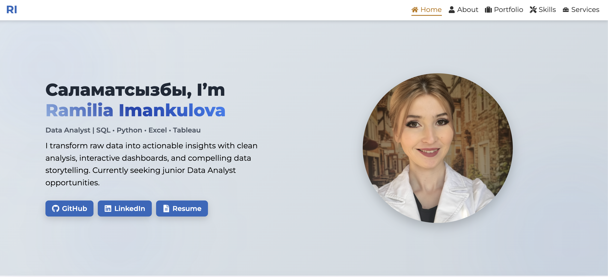
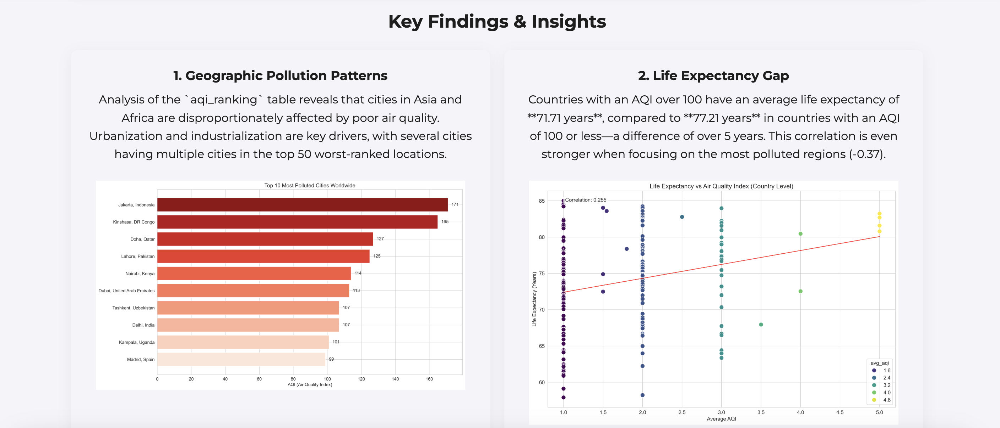
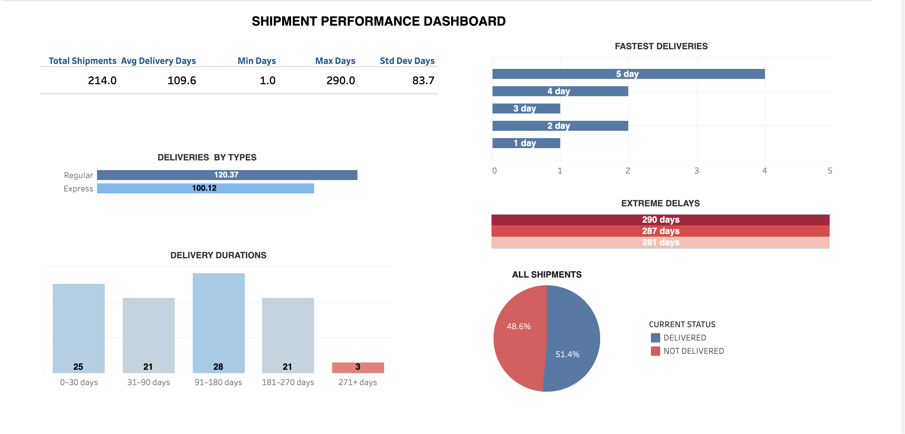
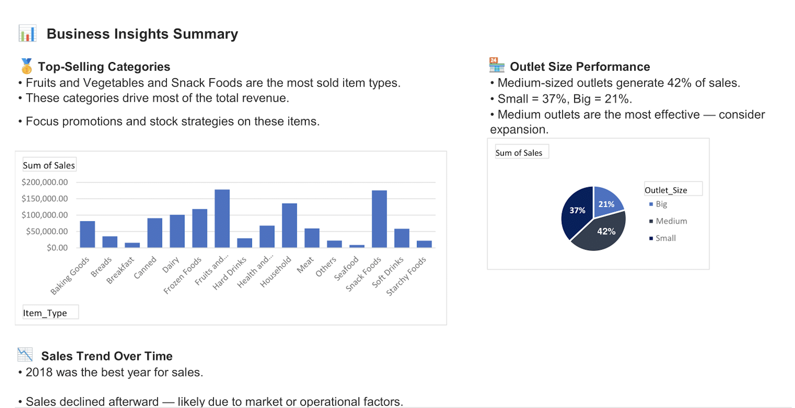
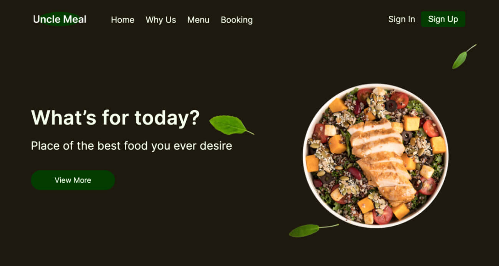
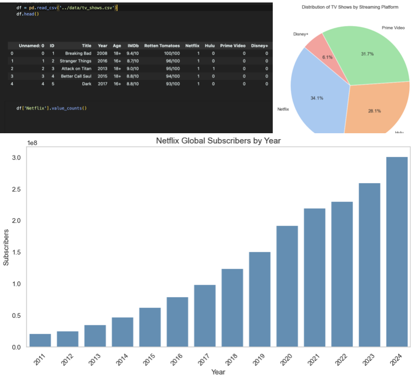

# 🌐 Ramilia Imankulova – Junior Data Analyst Portfolio

🚀 Welcome to my **Junior Data Analyst Portfolio Website**, showcasing projects in SQL, Python, Tableau, Excel, and Google Sheets.  
This portfolio demonstrates my full data workflow: from **raw data collection → cleaning & analysis → visualization → business insights**.

🔗 **Live Website:** [ramilia3110.github.io/portfolio](https://ramilia3110.github.io/portfolio)

---

## 👀 Preview

### 💻 Website

### 📊 Dashboards & Projects

| Project                           | Screenshot                                                                                                                             |
| --------------------------------- | -------------------------------------------------------------------------------------------------------------------------------------- |
| **Air Quality & Life Expectancy** |         |
| **Logistics SQL + Tableau**       |   |
| **Grocery Sales Excel Dashboard** |         |
| **Netflix Global Expansion**      |         |

---

## 📊 Featured Projects

### 🌍 Air Quality & Life Expectancy Analysis – _Python, SQL, Web Scraping_

- Scraped air quality and health datasets using **Selenium & APIs**.
- Stored and cleaned data in **PostgreSQL**.
- Applied **correlation, regression, and outlier detection**.
- Visualized findings with **Matplotlib & Seaborn**.  
  🔗 [View Project on GitHub](https://github.com/Ramilia3110/portfolio)

---

### 📦 Logistics Performance Analysis – _SQL & Tableau_

- Built SQL queries for **delivery performance metrics** (percentiles, delays, rates).
- Designed **Tableau dashboards** with KPIs and trends.
- Suggested optimizations for reducing shipment delays.  
  🔗 [View Project on GitHub](https://github.com/Ramilia3110/portfolio)

---

### 📊 Grocery Sales Performance – _Excel Dashboard_

- Cleaned & analyzed retail data with **formulas, pivot tables, regression, and correlation**.
- Built **interactive dashboard** showing category trends & outlet performance.
- Gave **business recommendations** for inventory & marketing.  
  🔗 [View Project on GitHub](https://github.com/Ramilia3110/portfolio)

---

### 🎬 Netflix Global Strategy Analysis – _Python, Jupyter_

- Combined multiple datasets on **Netflix shows, users, and markets**.
- Explored **content growth, global expansion, and subscriber behavior**.
- Built **visualizations (Seaborn, Matplotlib)** for strategy insights.  
  🔗 [View Project on GitHub](https://github.com/Ramilia3110/portfolio)

---

## 🛠️ Tech Stack

- **Languages & Tools**: SQL (MySQL, PostgreSQL), Python (Pandas, NumPy, Selenium, BeautifulSoup), React.js
- **Visualization**: Tableau, Matplotlib, Seaborn, Excel Dashboards
- **Analytics**: Descriptive Statistics, Regression, Hypothesis Testing, A/B Testing, Outlier Detection
- **Other**: Git/GitHub, Jupyter Notebook, REST APIs (basic), VS Code

---

## 👩‍💻 About Me

Hi, I’m **Ramilia Imankulova**, a **Junior Data Analyst** passionate about uncovering insights from messy datasets.  
I enjoy connecting business problems with **data-driven solutions**, and I specialize in **statistical analysis, visualization, and dashboards**.

📍 Bishkek, Kyrgyzstan  
📧 ramilia3110@gmail.com  
🔗 [LinkedIn](https://www.linkedin.com) | [GitHub](https://github.com/ramilia3110)

---

✨ This portfolio is a living project — I’ll keep adding new case studies, dashboards, and analyses as I grow my skills.
